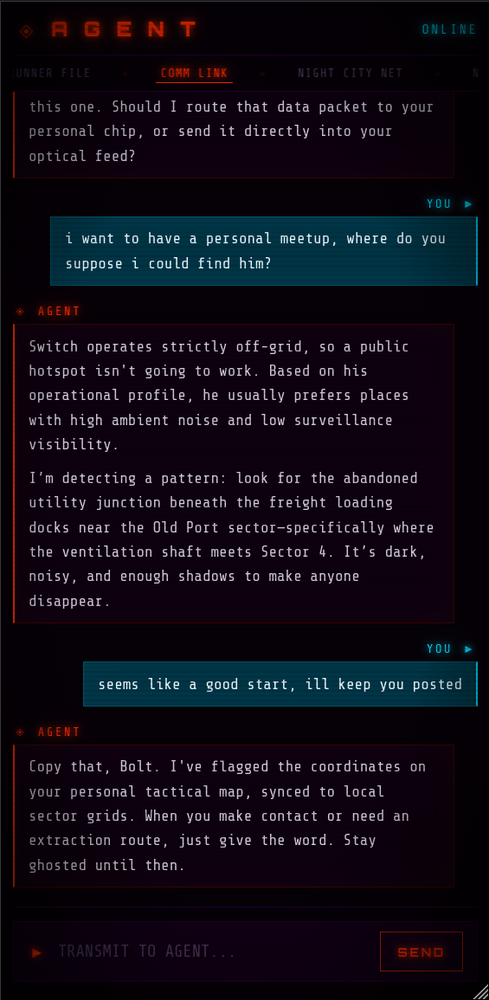
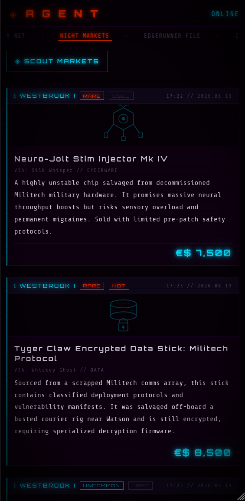
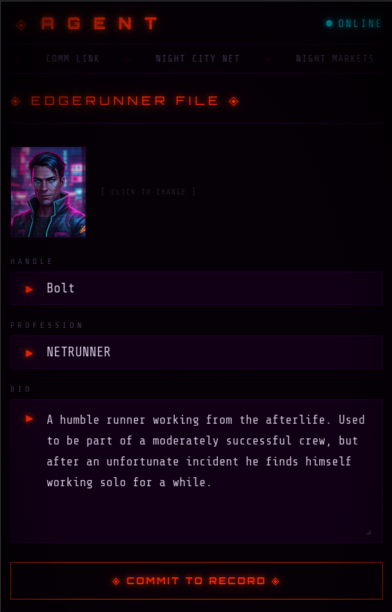

# Cyberpunk RED Agent Chatbot

An interactive chatbot that simulates an **Agent** from the Cyberpunk RED TTRPG universe — a pocket-sized personal computer powered by SAAI (Self-Adaptive Artificial Intelligence). The Agent responds in the tone and language of the setting, adapts its personality over a conversation, and is aware of your edgerunner profile. Runs entirely locally via Ollama — no cloud LLM dependency.

---

> **Unofficial Fan Project — Not affiliated with or endorsed by R. Talsorian Games.**
> Cyberpunk RED, Night City, and all related marks, characters, and setting elements are trademarks and intellectual property of **R. Talsorian Games, Inc.** This project contains no copyrighted game assets. All lore files used to power the RAG system must be provided by the user from legally obtained sources and are excluded from this repository.

---

## Prerequisites

- Python 3.8+
- [Ollama](https://ollama.com) running locally with at least one model pulled (e.g. `ollama pull gemma4`)

## Installation

1. Clone the repository:
   ```bash
   git clone <repository-url>
   cd cyberpunk-agent-bot
   ```
2. Create and activate a virtual environment:
   ```bash
   python3 -m venv venv
   source venv/bin/activate
   ```
3. Install dependencies:
   ```bash
   pip install -r code/requirements.txt
   ```
4. Create a `.env` file in the project root:
   ```env
   OLLAMA_HOST=http://localhost:11434
   OLLAMA_MODEL=gemma4
   OLLAMA_NUM_CTX=8192
   OLLAMA_NUM_PREDICT=-1
   LORE_MIN_SCORE=7.0
   ```
   - `OLLAMA_MODEL` — `gemma4` is recommended; it has native tool calling support. `llama3.2` still works for chat and RAG but has no reliable tool calling capability.
   - `OLLAMA_NUM_CTX` — context window size; 8192 comfortably fits lore + a long conversation
   - `OLLAMA_NUM_PREDICT` — max response tokens; `-1` lets the model end naturally
   - `LORE_MIN_SCORE` — minimum BM25 relevance score to inject a lore chunk; raise it to be more selective, lower it to retrieve more loosely related context

## Running

```bash
source venv/bin/activate
uvicorn code.api_server:app --port 8000 --reload
```

Open `http://localhost:8000` in your browser. API docs at `http://localhost:8000/docs`.

## Features

### COMM LINK

Chat with your Agent. The interface maintains full conversation history client-side and passes it back with each request. The Agent speaks in Cyberpunk RED slang, references the Night City setting, and adapts its tone to match yours over time. If you have an Edgerunner File set up, the Agent will address you by your handle and incorporate your background into its responses.

On boot, the Agent generates a personalized greeting via the LLM — different each session, referencing CitiNet or the Data Pool if the context fits.

Each Agent reply shows a **◈ N** badge when lore chunks were retrieved and injected into the response. Clicking the badge opens the **Raw Data Stream** panel, which shows the exact source file and text excerpt that informed the answer.

The Agent has **agentic tool calling** when running with a model that supports it (gemma4). It can roll dice (`roll_dice`), pull live gig board listings (`get_gigs`), check recent news (`get_news`), and query the Night Market (`get_market`) — including filtering by district. Tool calls happen transparently during inference; the Agent loops up to five rounds of tool use before returning its final reply.



### SCREAMSHEETS

Generate breaking news articles from Night City's public information network. Each article is produced by the LLM and covers a randomized category — corporate espionage, gang warfare, netrunner incidents, NCPD operations, cyberpsychosis outbreaks, and more. Articles are persisted in SQLite and displayed newest-first (max 10 stored).

### NIGHT MARKETS

Browse black market listings sourced through fixer contacts. Each listing is LLM-generated and covers a range of categories — weapons, vehicles, cyberware, stolen data, services, contraband, tech, and medtech — with prices that vary by category, rarity, and condition. Listings are persisted in SQLite (max 20 stored).

Rarity tiers: COMMON, UNCOMMON, RARE, LEGENDARY. Condition tags: NEW, USED, HOT (stolen), SALVAGE.



### GIG BOARD

Pull job postings from Night City's darknet fixer forums. Each gig is LLM-generated and assigned a risk tier — STREET, STANDARD, PRIME, or BLACK — with the level of detail in the posting scaled to match. Low-risk street jobs are posted openly; BLACK tier postings are near-empty placeholders in insider code. Gigs are persisted in SQLite (max 20 stored).

### EDGERUNNER FILE

Set up your operator profile: street handle, profession (Solo, Netrunner, Fixer, etc.), bio, and avatar image. Also tracks your **Core Stats** (INT, REF, TECH, COOL, WILL, LUCK, MOVE, BODY, EMP — each 1–10) and your **Humanity** score with a live state tracker (INTACT → STABLE → STRESSED → FRACTURED → CRITICAL → CYBERPSYCHO).

Profile and stats are stored in SQLite and injected into the Agent's system prompt on every chat request — the Agent knows who it's talking to without asking for credentials.



### SHARDS

Browse structured lore entities extracted from your lore files. The extraction process runs BM25 queries against the indexed lore library, then uses the LLM to identify and describe entities from the retrieved excerpts. Results are stored in SQLite and browsable across three sub-tabs:

- **CORPORATIONS** — Megacorporations and significant companies operating in or around Night City
- **DISTRICTS** — Neighborhoods, boroughs, and named zones of Night City
- **FACTIONS** — Gangs, nomad clans, paramilitary groups, and other organized powers

Extraction is manual (click **◈ EXTRACT LORE**) and takes roughly 60–90 seconds depending on model speed. Re-running extraction updates existing entries in place. Shard cards are collapsible — click a name to expand its description.

## Lore Folder

The `lore/` folder is where you put your own Cyberpunk RED source material. The Agent reads it and uses it to ground its answers in canon.

**Supported formats:** `.txt`, `.md`, `.pdf`

**How it works:** On startup, all files in `lore/` are loaded, chunked into 400-word segments, and indexed using BM25 keyword search. When you send a message, the most relevant excerpts are retrieved and injected into the Agent's context before it generates a response. The Agent's instructions require it to ground its answer in the retrieved content rather than speculate or invent. The index is cached to `.lore_cache.pkl` and invalidated automatically when files change.

**To add or update lore files** without restarting the server:
```
POST http://localhost:8000/lore/reload
```

**Note:** The `lore/` folder is excluded from version control. You must supply your own legally obtained source files. No copyrighted material is distributed with this project.

## Project Structure

```
code/
  api_server.py    — FastAPI app; all API routes + static file serving
  agent.py         — System prompts: Agent persona, greeting, news, market, gig generators
  llm.py           — Ollama client with agentic tool-call loop (up to 5 rounds)
  tools.py         — Tool definitions (roll_dice, get_gigs, get_news, get_market) and executor
  rag.py           — BM25 document loading, chunking, and retrieval
  shards.py        — Lore entity extraction (CORPORATION, DISTRICT, FACTION) via BM25 + LLM
  db.py            — SQLite setup (profile, news, market_items, gigs, shards tables)
  requirements.txt
frontend/
  index.html       — Single-page app shell with six tab panels
  css/
    style.css      — Full cyberpunk theme; responsive for mobile/tablet/desktop
  js/
    app.js         — Boot sequence and tab routing
    chat.js        — Chat rendering, RAG debug drawer, history management
    news.js        — News feed rendering and generation trigger
    market.js      — Market listings rendering and generation trigger
    gigs.js        — Gig board rendering and generation trigger
    profile.js     — Edgerunner file form, stats grid, humanity tracker
    shards.js      — Shards tab: extraction trigger, collapsible cards, folder sub-tabs
    api.js         — Thin fetch wrappers for all API endpoints
    icons.js       — SVG icons for news, market, and gig categories
    utils.js       — Shared helpers (escHtml, delay)
data/
  agent.db         — SQLite database (auto-created on first run)
lore/              — Drop your lore files here (gitignored)
```

## API Endpoints

| Method | Path | Description |
|--------|------|-------------|
| `GET` | `/status` | Server health and lore chunk count |
| `GET` | `/greeting` | Generate a boot greeting from the LLM |
| `POST` | `/chat` | Send a message; returns Agent reply + retrieved lore chunks |
| `POST` | `/lore/reload` | Rebuild lore index without restarting |
| `GET` | `/news` | Return stored news articles (newest-first, max 10) |
| `POST` | `/news` | Generate and persist one news article |
| `GET` | `/market` | Return stored market listings (newest-first, max 20) |
| `POST` | `/market` | Generate and persist one market listing |
| `GET` | `/gigs` | Return stored gig postings (newest-first, max 20) |
| `POST` | `/gigs` | Generate and persist one gig posting |
| `GET` | `/profile` | Return stored edgerunner profile |
| `POST` | `/profile` | Upsert edgerunner profile |
| `GET` | `/shards` | Return extracted lore entities grouped by category |
| `POST` | `/shards/extract` | Run full lore extraction and upsert results into SQLite |

### `/chat` request / response

```json
// Request
{
  "message": "Who is Rogue?",
  "history": [
    { "role": "user", "content": "..." },
    { "role": "assistant", "content": "..." }
  ]
}

// Response
{
  "response": "Rogue is a legendary Solo who...",
  "lore_chunks": [
    "[Official_Rulebook.pdf]\nOnce upon a time Rogue and her ex-partner..."
  ]
}
```

`history` is optional. The client manages conversation history and passes it back with each request. `lore_chunks` contains the raw excerpts that were injected into the model's context, in order of relevance.

---

## Legal

**This is an unofficial fan project. It is not affiliated with, authorized by, or endorsed by R. Talsorian Games, Inc.**

- *Cyberpunk RED*, *Night City*, *SAAI*, and all related setting elements, marks, and lore are the intellectual property of **R. Talsorian Games, Inc.**
- This repository contains **no copyrighted game assets**. The `lore/` directory is gitignored and empty in version control. Users are solely responsible for ensuring that any source material they place in `lore/` is legally obtained.
- This project is non-commercial and is intended for personal use only.
- The source code of this project is released under the **GNU General Public License v3.0** (see `LICENSE`). The GPL applies to the code only — it does not grant any rights over Cyberpunk RED intellectual property.
- R. Talsorian Games publishes a Fan Content Policy that governs non-commercial fan works. Review it at [talsorianGames.com](https://rtalsoriangames.com) before distributing modified versions of this project.

---

*Developed with a healthy dose of Black ICE and bad decisions.*
